# Freemarker模板学习笔记一


---

## **前言**

工程要用到，需要先熟悉基本的用法，后期再深入了解。


---
## **模板**

Freemarkder是一门模板语言，用来前后端分离的。
总体结构由**文本，插值，FTL标签，注释**组成。一个图来说明：

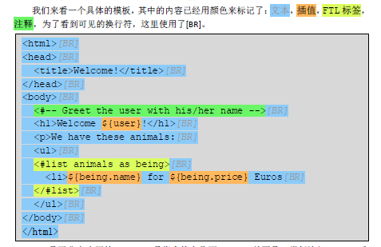

---

## **指令**

说说内部指令。

### if指令

``` html
<html> 
<head> 
<title>Welcome!</title> 
</head> 
<body> 
<h1> 
Welcome ${user}<#if user == "Big Joe">, our beloved leader</#if>! 
</h1> 
<p>Our latest product: 
<a href="${latestProduct.url}">${latestProduct.name}</a>! 
</body> 
</html>
```

判断条件，当condition的判断结果为false（布尔值）时，在`<#if condition>`和`</#if>`标签之间的内容将会被略过。
``` html
<#if animals.python.price != 0> 
Pythons are free today! 
</#if>
```

!=就是不等于。

### else指令
有了if就不能没有else。

``` html
<#if animals.python.price < animals.elephant.price> 
Pythons are cheaper than elephants today. 
<#else> 
Pythons are not cheaper than elephants today. 
</#if>
```

### list指令

用来批量处理：
``` html
<p>We have these animals: 
<table border=1> 
<tr><th>Name<th>Price 
<#list animals as being> 
<tr><td>${being.name}<td>${being.price} Euros 
</#list> 
</table> 

<p>We have these animals: 
<table border=1> 
<tr><th>Name<th>Price 
<tr><td>mouse<td>50 Euros 
<tr><td>elephant<td>5000 Euros 
<tr><td>python<td>4999 Euros 
</table>
```

### include指令


在当前模板中插入其他文件的内容
``` html
<html> 
<head> 
<title>Test page</title> 
</head> 
<body> 
<h1>Test page</h1> 
<p>Blah blah... 
<#include "/copyright_footer.html"> 
</body> 
</html>
```

copyright_footer.html内容如下：
``` html
<hr> 
<i> 
Copyright (c) 2000 <a href="http://www.acmee.com">Acmee Inc</a>, 
<br> 
All Rights Reserved. 
</i>
```

最后结果为：

``` html
<html> 
<head> 
<title>Test page</title> 
</head> 
<body> 
<h1>Test page</h1> 
<p>Blah blah... 
<hr> 
<i> 
Copyright (c) 2000 <a href="http://www.acmee.com">Acmee Inc</a>, 
<br> 
All Rights Reserved. 
</i> 
</body> 
</html>
```

### 默认值
``` html
<h1>Welcome ${user!"Anonymous"}!</h1>
```

如果user不存在，则取Anonymous，看demo：

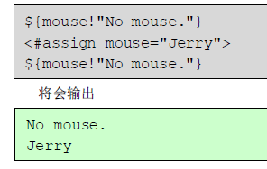

### 检查不存在值

利用??操作符。

Assign 
看demo：

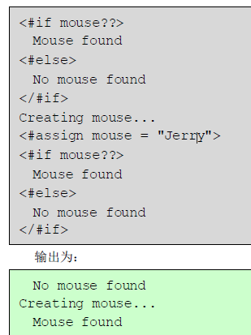

这里需要注意，我们在使用freemarker获取后端回填数据时，必须使用??来判断是否存在，再进行使用。或者通过default来赋予默认值，否则会出现如果后端未回填则前端报错**完全崩溃**的情况。

看下面的解决方案：

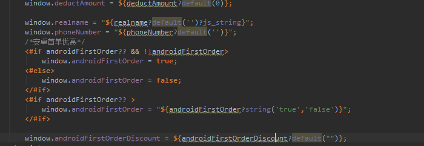


---

## **内建函数**

内建函数以？形式提供变量的不同形式或者其他信息。多个内建函数可以通过?连接来使用。
Html cap_first lower_case upper_case trim size int number_to_datetime eval
 default

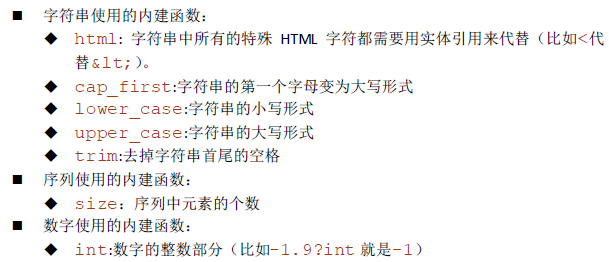

使用方式如下：

``` html
${test?html} 
${test?upper_case?html}
```

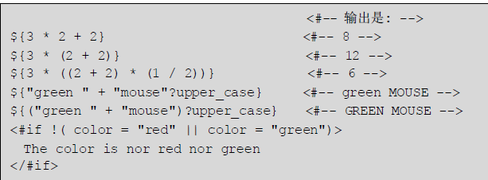


###  **number_to_datetime**

一个转换时间格式的内建函数

``` html
    <#list liveDtos as live>
    <#setting datetime_format="MM月dd日 HH:mm"/>
      <#if live_index lt 2>
       <a class="c f-fc3 f-thide" data-index="${live_index+1}" data-name="${live.courseName?default('')?html}" href="${courseIntroPrefix?replace('{id}',live.courseId?default(0))}" target="_blank" title="${live.courseName?default('')?html}">
        [${live.liveStartTime?number_to_datetime}] ${live.courseName?default('')?html}
       <#if live.free?default(0) == 1>（免费）</#if>
      </a>
      </#if>
     </#list>
```

还有一种简单的使用方式：

``` html
${item.time?number_to_datetime?string["MM-dd HH:mm"]}
```

即可解决问题。


###  **defaule**

**默认值**
如果不存在就取默认值，用法举例:

``` html
${pageTitle?default("[]")}
```

###  **eval**

将字符串作为ftl模板输出，就和javascript原生的eval有点类似。

用法举例：

``` html
${(col['name']?eval)}
```

可以多个函数连着一起使用：

``` html
<#assign jrqf=jrqf?default('{}')?eval/>
```


### **size**

很常用的内建函数，判断list的长度。比如说我们需要在数组中超过一个以上的时候再显示某些字段：

``` html
<div class="m-teacher-lists">  
    <#if detailInfoResult?? && detailInfoResult.teachers??>
        <#list detailInfoResult.teachers as item>
        <div class="item f-pr">  
            <div class="tri f-pa" style="border-bottom:.82rem solid ${mc?default('#fff')}"></div>  
            
            <div class="info f-mhfc f-mcbg">   
                <#if (detailInfoResult.teachers?size > 1)>
                <div class="title"><span class="f-icon f-pr icon-num-${item_index+1}" style="font-size:1rem;top:.1rem;"></span>${item.courseName?default('')}</div>
                </#if>
                <div class="name">${item.name?default('')}</div>
                <div class="tx">${item.title?default('')}</div>
                <p class="des">${item.description?default('')}</p>
            </div>
        </div>                      
        </#list>
    </#if>              
</div>
```

又比如说我们把list之前需要判断数组是否为空，仅仅用??不够，还需要利用size:

``` html
<#if detailInfoResult.specialTeacher?? && (detailInfoResult.specialTeacher?size > 0)>   
    <#list detailInfoResult.specialTeacher as item>
        <#assign specialTeacherName = "${item.name?default('')}" />
        <#assign specialTeacherTitle = "${item.title?default('')}" />
        <#assign specialTeacherImgUrl = "${item.imgUrl?default('')}" />
        <#assign specialTeacherDes = "${item.description?default('')}" />
    </#list>
</#if>

```


---

## **插值**

使用场景分为**文本区**和**字符串表达式**：
```
<h1>Hello ${name}!</h1>

<#include "/footer/${company}.html">
```
所以说，不要在不能使用插值的地方使用它！！！比如
```
<#if ${isBig}>WOW!</#if>
```
就是错误的，要改成：
```
<#if isBig>WOW!</#if>
```

### 字符串插值转义

看下面的例子：

 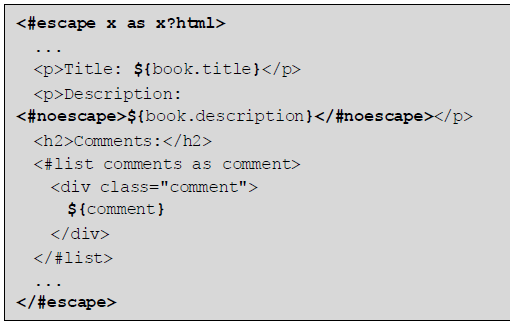

转换结果为：

 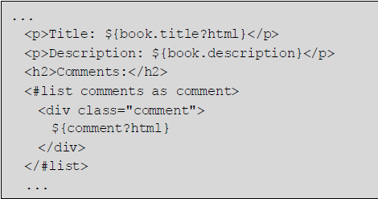

可以看到在escape区域中而不属于noescape的区域的插值都**从x变为了x?html**。这样就可以转义这些插值中的特殊字符了。


---

## **自定义指令**

**macro指令**来定义。
使用**#来定义**宏，使用**@来使用**宏：

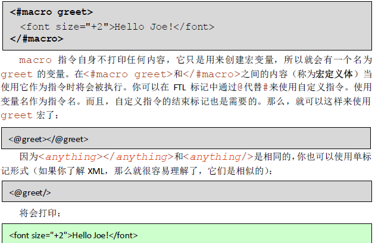
 
### 参数

定义宏时可以带参数，使用时可以带参数。

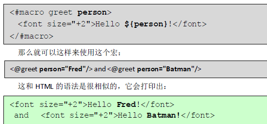 

如果是多参数，参数的顺序并不重要：

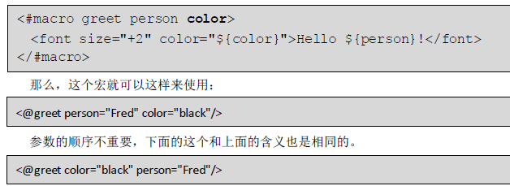


### 嵌套内容

通过**#nested**来嵌套内容。
看一个demo：

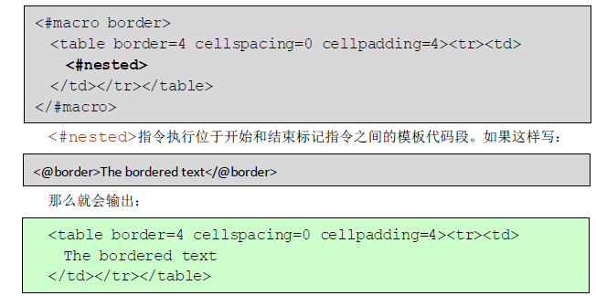

也可以多次使用：

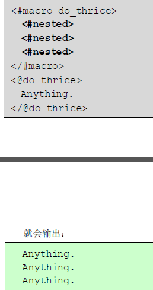 


嵌套的内容可以是宏，运用得好将非常灵活：

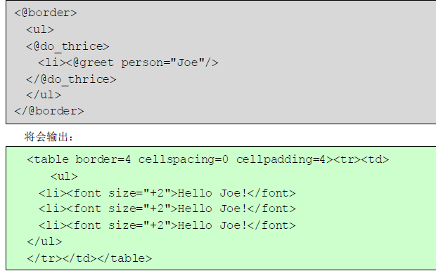 

### 宏中的循环

前面说到用list指令可以实现循环，那么在宏中也可以有循环，也是利用nested：

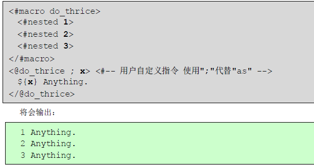 

一个宏可以使用多个循环变量：

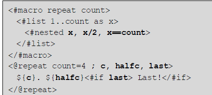
 
输出：

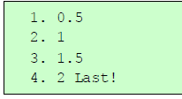
 
好好体会..的用法。


---

## **定义变量**


在模板中可以定义三种类型的变量：
**简单变量**，它能从模板中的任何位置来访问，或者从使用include指令引入的模板访问。可以使用assign和macro指令来创建或替换这些变量。
**局部变量**，它们只能被设置在宏定义体内，而且只在宏内可见。使用local指令。
**循环变量**，由指令自动创建的。

先看看简单变量assign：

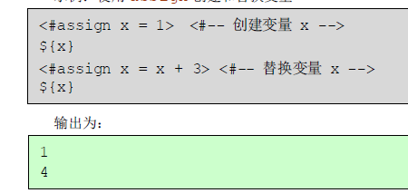

再来说说局部变量和循环变量，**局部变量会隐藏同名的简单变量，循环变量会隐藏同名的局部变量和简单变量**：

 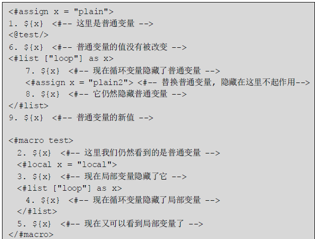

输出结果为：

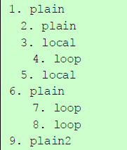 


如果都是循环变量，则**内部循环变量会隐藏外部循环变量**：

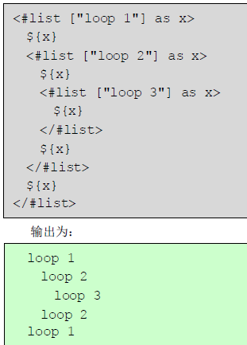

如果想要跳出作用域，直接使用数据模型中的变量，**使用globals关键字**即可：

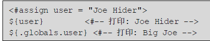


可以查看demo：

``` html
<#if displaySettingResult.headImg??>
    <#assign headImgBgColor = "${displaySettingResult.headImg.bgColor?default('#2aa126')}" />
    <#assign headImgMobImgUrl = "${displaySettingResult.headImg.mbImgUrl?default('')}" />  
    <#assign headImgFontColor = "${displaySettingResult.headImg.fontcolor?default('#fff')}" />  
    <#assign headImgMobOneDes = "${displaySettingResult.headImg.mbOneDescribtion?default('')}" />  
    <#assign headImgMobDes = "${displaySettingResult.headImg.mbMoreDescribtion?default('')}" />  
</#if>
<#if displaySettingResult.producers??>
    <#assign productBgColor = "${displaySettingResult.producers.bgColor?default('#cccccc')}" />
    <#assign productImgUrl = "${displaySettingResult.producers.bgImgUrl?default('')}" />
    <#assign productDes = "${displaySettingResult.producers.describtion?default('')}" />
    <#assign productLogoImgUrl = "${displaySettingResult.producers.logoImgUrl?default('')}" />
    <#assign productLogoLink = "${displaySettingResult.producers.logoLink?default('')}" />      
</#if>

```

---

## **命名空间**

### 定义

我们通过assign和macro创建的变量的集合就是命名空间。命名空间的作用在各种编程语言中都已见识，这里假设我们定义了自己的macro和assign位于lib/my_test.ftl中。

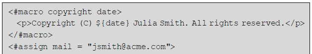

``` html
<#macro copyright date> 
<p>Copyright (C) ${date} Julia Smith. All rights reserved.</p> 
</#macro> 
<#assign mail = "jsmith@acme.com">
```

通过import来引用：

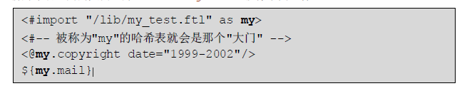

``` html
<#import "/lib/my_test.ftl" as my> 
<#-- 被称为"my"的哈希表就会是那个"大门" --> 
<@my.copyright date="1999-2002"/> 
${my.mail}
```

最后得到效果：

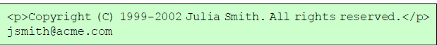 


### 覆盖变量

引入命名空间后替换变量需要在assign的基础上**加上in关键字**：


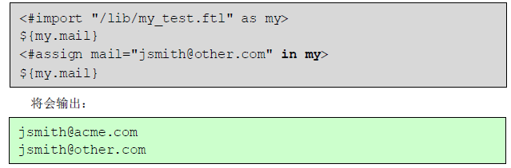
 

---

## **对象挂载**

有时候，后端会回填一个对象，我们希望将其挂载在window对象上进行查阅，也方便操作。但是freemarker只支持字符串类型的插值，所以我们必须进行如下操作：

``` html
   <#if webUser?exists>
    window.webUser = {
		<#if webUser.id?exists>id:"${webUser.id?html}",</#if>
		<#if webUser.nickName?exists>nickName:"${webUser.nickName?html}",</#if>
        <#if webUser.roles?exists>yoocRoles:[
            <#list webUser.roles as role>
                "${role}"<#if role_has_next>,</#if>
            </#list>
        ],</#if>
        <#if webUser.studyRoles?exists>studyRoles:[
            <#list webUser.studyRoles as srole>
                "${srole}"<#if srole_has_next>,</#if>
            </#list>
        ],</#if>
        <#if webUser.passport?exists>passport:"${webUser.passport?html}",</#if>
        <#if webUser.personalUrlPrefix?exists>personalUrlPrefix:"${webUser.personalUrlPrefix?html}",</#if>
        <#if webUser.personalUrlSuffix?exists>personalUrlSuffix:"${webUser.personalUrlSuffix?html}",</#if>
        <#if webUser.smallFaceUrl?exists>smallFaceUrl:"${webUser.smallFaceUrl?html}",</#if>
        <#if webUser.largeFaceUrl?exists>largeFaceUrl:"${webUser.largeFaceUrl?html}",</#if>
        <#if webUser.loginId?exists>loginId:"${webUser.loginId?html}",</#if>
        <#if webUser.loginType?exists>loginType:"${webUser.loginType?html}",</#if>
        <#if webUser.username?exists>username:"${webUser.username?html}",</#if>
        <#if webUser.email?exists>email:"${webUser.email?html}",</#if>
        <#if webUser.accountType?exists>accountType:"${webUser.accountType?html}",</#if>
        end_key:"end_value"
    };
   </#if>

```

对对象的每一个属性进行单独处理，这样就很尴尬了。

提出一个freemarker公共方法：

``` html
<#-- 将ftl中的对象转换成json，只转换hash 和 数组 类型数据-->
<#-- 注意有个坑就是 string?is_hash 也是 true -->
<#-- item.class.simpleName == 'Boolean' 相当于 item?is_boolean-->
<#function objectToJsonFunction object>
    <#if object??>
        <#if object?is_enumerable>
            <#local json = '['>
            <#list object as item>
                <#if item?is_number >
                    <#if item_index &gt; 0 && json != "[" >
                        <#local json = json +',' >
                    </#if>
                    <#local json = json + '${item}'>
                <#elseif item?is_string>
                    <#if item_index &gt; 0 && json != "[" >
                        <#local json = json +',' >
                    </#if>
                    <#local json = json + '"${item?default("")?js_string}"'>
                <#elseif item?is_boolean  >
                    <#if item_index &gt; 0 && json != "[" >
                        <#local json = json +',' >
                    </#if>
                    <#local json = json + '${item?string("true", "false")}'>
                <#elseif item?is_enumerable && !(item?is_method) >
                    <#if item_index &gt; 0 && json != "[" >
                        <#local json = json +',' >
                    </#if>
                    <#local json = json + objectToJsonFunction(item)>
                <#elseif item?is_hash>
                    <#if item_index &gt; 0 && json != "[" >
                        <#local json = json +',' >
                    </#if>
                    <#local json = json + objectToJsonFunction(item)>
                </#if>
            </#list>
            <#return json + ']'>
        <#elseif object?is_hash>
            <#local json = "{">
            <#assign keys = object?keys>
            <#list keys as key>
                <#if object[key]?? && !(object[key]?is_method) && key != "class">
                    <#if object[key]?is_number>
                        <#if key_index &gt; 0 && json != "{" >
                            <#local json = json +',' >
                        </#if>
                        <#local json = json + '"${key}": ${object[key]}'>
                   <#elseif object[key]?is_string && !(object[key]?is_enumerable)>
                        <#if key_index &gt; 0 && json != "{" >
                            <#local json = json +',' >
                        </#if>
                        <#local json = json + '"${key}": "${object[key]?default("")?js_string}"'>
                    <#elseif object[key]?is_boolean >
                        <#if key_index &gt; 0 && json != "{" >
                            <#local json = json +',' >
                        </#if>
                        <#local json = json + '"${key}": ${object[key]?string("true", "false")}'>

                    <#elseif object[key]?is_enumerable && !(object[key]?is_method)>
                        <#if key_index &gt; 0 && json != "{" >
                            <#local json = json +',' >
                        </#if>
                        <#local json = json + '"${key}":'+ objectToJsonFunction(object[key])>

                    <#elseif object[key]?is_hash>
                        <#if key_index &gt; 0 && json != "{" >
                            <#local json = json +',' >
                        </#if>
                        <#local json = json + '"${key}":'+ objectToJsonFunction(object[key])>
                    </#if>
                </#if>
            </#list>
            <#return json +"}">
        </#if>
    <#else>
        <#return "{}">
    </#if>
</#function>

```

使用的时候只需要调用就可以了：

``` html
<#if displaySettingResult?exists>    
window.displaySettingResult = ${objectToJsonFunction(displaySettingResult)};  
</#if>

```


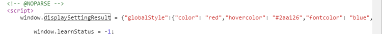

是不是方便了很多呢？