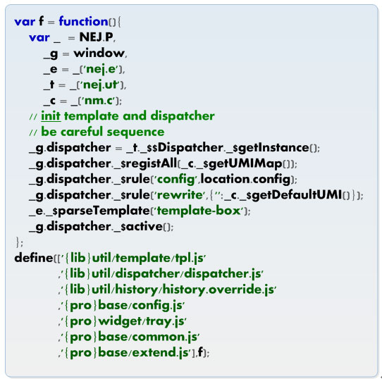

# **NEJ之文件依赖**

## **前言**

本文主要说说NEJ的文件依赖系统用法。主要是define方法和对应的js文件引入之间的关系。最后给出了基本的demo。

---

## **路径配置**

文件定义时指定的路径可以通过路径配置的变量来指定前缀：


我们来看一个项目中的demo，我们在html或者ftl中引用js：

``` html
    <script src="/src/javascript/vendor/nej/src/define.js?pro=/src/javascript/web/&core=/src/javascript/core/"></script>
    <script src="/src/javascript/web/pages/cloudClass/myCloudClass.js"></script> 
```


然后我们在引入的js文件myCloudClass.js中这样定义文件依赖：

``` javascript
define('{pro}pages/cloudClass/myCloudClass.js',
      ['{lib}util/dispatcher/dispatcher.2.js',
       '{pro}util/util.js','{core}util/userUtil.js',
    '{lib}util/template/tpl.js'],f);
```
可以看到，pro和core是我们上面define.js的参数。

从上面的例子中我们还可以学到的是模块的定义和依赖。

系统默认预置了lib、pro、platform的路径配置。

### lib

NEJ框架路径配置名称为”lib”，文件定义和依赖时可直接使用”{lib}”来表示框架的路径，默认此路径为外联的define.js文件所在的路径。

```
<script src="/path/to/nej/define.js"></script>
```

```
NEJ.define([
    'base/element',
    'lib/base/element',
    '{lib}base/element.js'
],function(e1,e2,e3){

    // 这里解析出来的lib为 /path/to/nej/
    // 以上三种方式访问的为同一个文件都是 /path/to/nej/base/element.js 文件

});
```
### pro

项目脚本根路径配置名称为“pro”，文件定义和依赖时可直接使用pro或“{pro}”来表示脚本根路径，此配置信息可以通过外联的define.js路径中的查询串进行配置。如果没有自定义配置则默认相对于当前页面访问路径的“../javascript/”路径。

```
<script src="/path/to/nej/define.js?pro=./"></script>
```

```
NEJ.define([
    'pro/api/element',
    '{pro}/api/element.js'
],function(e1,e2){

    // 以上两种方式访问的为同一个文件都是 ./api/element.js 文件

});
```


---

## **define**

我们来说说define方法：

带三个参数依次为：当前文件路径，依赖文件列表，文件执行函数


可以忽略当前文件路径。

**文件路径遵循以下规则**

完整的文件路径，如 http://a.b.com/patch/to/file.js
使用{}标识配置参数，如{root}file.js
直接使用非{}标识配置参数，此时不能加.js后缀，系统自动加.js后缀，如 root/file
NEJ库文件可以省略lib标识，如base/element，等价于 lib/base/element，等价于 {lib}base/element.js
其他文本资源采用text!前缀标识，如text!/path/to/file.css，注意开发时如果资源是跨域的请设置好浏览器XHR的跨域支持
JSON资源采用json!前缀标识，如json!/path/to/data.json，注意开发时如果资源是跨域的请设置好浏览器XHR的跨域支持
**Regular模板资源采用regular!前缀标识**，如regular!/path/to/file.html，注意开发时如果资源是跨域的请设置好浏览器XHR的跨域支持
路径以 ./ 或者 ../ 开始的相对路径则相对于当前脚本文件的路径，如 ./util.js

**执行函数注入参数说明**

注入依赖列表中各文件对应的返回结果
注入**额外四个参数**，依次为p、o、f、r，其中
p为输出结果集空间，用于注入到其他执行函数中的内容
o为对象实例，即{}，用于处理对象默认值，如 var x = options||o;
f为函数实例，返回false，用于处理方法默认值，如 var func = x.onready||f;
r为数组实例，即[]，用于处理数组默认值，如 var arr = options.list||r;

查看demo

``` javascript
NEJ.define([
    'util/ajax/tag',
    'util/template/jst'
],function(j,e,p,o,f,r){

    // j 为 util/ajax/tag 文件导出的接口集合
    // e 为 util/template/jst 文件导出的接口集合

    // 用于注入到其他文件执行函数中的接口
    p.api = function(){

    };

    // TODO something

    return p;
});
```


---

## **应用**

下面看一个基本的模块：


和一个稍微复杂一点的模块：




---

## **感悟**

应该是AMD规范的写法，考虑到该框架的创建时间，觉得公司的工程师还是技术挺先进的。


