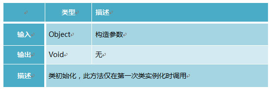
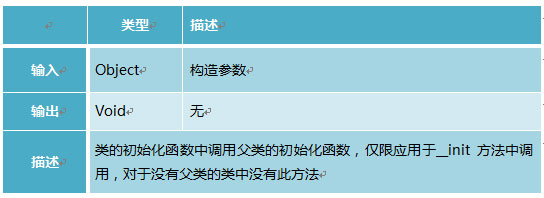
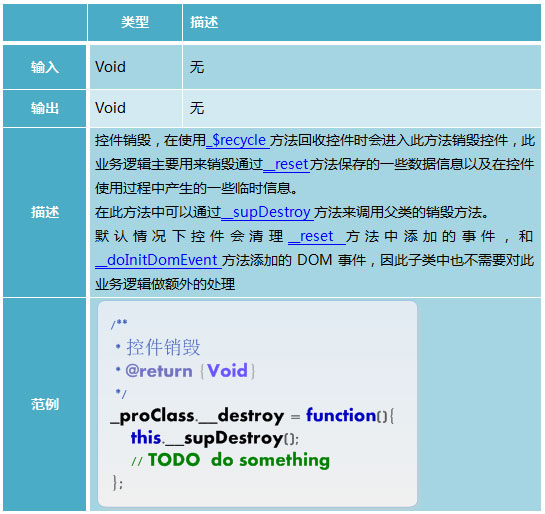
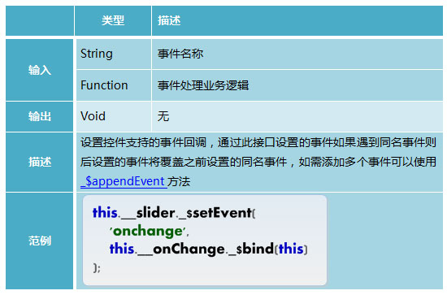
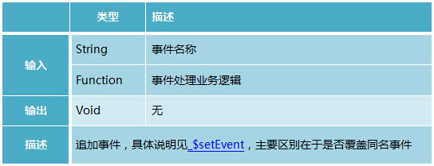

# **NEJ之组件化开发**


## **前言**

组件是一个可以独立运行的系统或模块，其目的是为了将程序模块化，实现重用。本文主要是对NEJ的组件化开发方式进行学习。


---

## **类模型**

### **定义NEJ.C**

使用NEJ.C方法来定义一个类：


通过此方法定义的类具有以下特性：
1. 具有静态方法_$extend，可以从其他类继承
2. 实例具有`init`方法用来初始化组件，该方法中通过`supInit`调用父类`__init`方法。

### **继承_$extend**

通过NEJ.C定义的类可以通过`_$extend`方法来继承：


### **实现init**


通过NEJ.C定义的类可以使用`init`来初始化类：

__init






---

## **组件体系**

体系结构如下：


底层都是事件驱动，分为Util和UI组件。

Util主要是**业务逻辑的实现**，UI主要是对**组件的视觉外观以及结构**的实现。

由于UI是紧耦合，所以**Util可以用来重用**，在不同的地方**只需要调整对应的UI**即可。

---


## **Util组件**

NEJ中所有组件都继承自nej.ut._$$Event类，该类主要实现组件分配回收的业务逻辑及对事件驱动的支持,此类控件关注功能业务逻辑的实现，不关注视觉效果。一般由NEJ框架来进行统一维护。


控件采用分配回收重用机制，因此控件需实现__init、__reset、__destroy接口，其他扩展的业务逻辑根据控件实际需求实现：

``` javascript
NEJ.define([
    'base/klass',
    'util/event'
],function(_k,_t,_p){
    var _pro;
    // 定义控件
    _p._$$Widget = _k._$klass();
    // 继承_$$EventTarget
    _pro = _p._$$Widget._$extend(_t._$$EventTarget);
    // 控件首次创建构造过程
    _pro.__init = function(){
        this.__super();
        // TODO
    };
    // 控件重复使用重置过程
    // 重置过程可以接受到分配控件时输入的配置信息
    _pro.__reset = function(_options){
        this.__super(_options);
        // TODO
    };
    // 控件回收销毁过程
    _pro.__destroy = function(){
        this.__super();
        // TODO
    };

    // 扩展私有接口
    _pro._myPrivateMethod = function(){
        // TODO
    };
    // 扩展保护接口
    _pro.__myProtectedMethod = function(){
        // TODO
    };
    // 扩展对外接口
    _pro._$myPublicMethod = function(){
        // TODO
    };

    // TODO

    return _p;
});
```


类方法：

### **_$allocate**


### **_$recycle**

组件使用分配回收机制，而不是new机制。


``` javascript
NEJ.define([
    '/path/to/widget.js'
],function(_t){
    // 分配控件
    var _widget = _t._$$Widget._$allocate({
        a:'aaaaaaaa',
        b:'bbbbbbbbbbb',
        c:'ccccccccccccc',
        onchange:function(_event){
            // 控件支持的事件
            // _event.x
            // _event.y

            // TODO
        },
        onupdate:function(_event){
            // 控件支持的事件
            // _event.a
            // _event.b

            // TODO
        }
    });

    // 外界可以调用控件的public方法
    _widget._$myPublicMethod();

    // 回收控件
    // 注意这里必须将原控件持有的引用置空
    _widget = _widget._$recycle();
    // 或者
    _widget._$recycle();
    _widget = null;
});
```

### **_$getInstance**


实例方法：

### **__reset**


该方式是控件重置时触发的，父容器和子组件通信时可以通过传递参数，然后子组件在该阶段接收参数.
看一个demo，父容器中通过allocate调用子组件时传入参数codeType：


子组件在reset时接收参数，通过options统一管理参数：


### **__supReset**


### **__destroy**




### **__supDestroy**


### **__doInitDomEvent**


当我们需要给一群节点绑定事件时，需要通过forEach和该方法配合来绑定事件。
看一个demo：


如果需要绑定的节点较多，我们也可以通过NEJ版的事件委托来处理：

``` javascript

v._$addEvent(this.__validRdosNodes,'click',function(_event){    
    var _node = v._$getElement(_event,'c:j-validTypeRdo');       
    if(!!_node){
        switch(e._$id(_node)){
            case 'validTypeRdo-1' : 
                eu._$showNode(this.__validDateNode);
                break;
            case 'validTypeRdo-2' :
                eu._$hiddenNode(this.__validDateNode);                      
                break;            
            default :
                break;    
        }
    }
}._$bind(this)); 

```
      
### **_$recycle**


事件方法：

### **_$setEvent**



### **_$batEvent**


### **_$hasEvent**


### **_$clearEvent**


### **_$appendEvent**




### **_dispatchEvent**

通过自定义事件的触发来进行通信。


这里看一个实例：
``` javascript
NEJ.define([
    'base/klass',
    'util/event'
],function(_k,_t,_p){
    var _pro;
    // 定义控件
    _p._$$Widget = _k._$klass();
    // 继承_$$EventTarget
    _pro = _p._$$Widget._$extend(_t._$$EventTarget);
    // 控件首次创建构造过程
    _pro.__init = function(){
        this.__super();
        // TODO
    };
    // 控件重复使用重置过程
    // 重置过程可以接受到分配控件时输入的配置信息
    _pro.__reset = function(_options){
        this.__super(_options);
        // TODO
    };
    // 控件回收销毁过程
    _pro.__destroy = function(){
        this.__super();
        // TODO
    };

    // 扩展私有接口
    _pro._myPrivateMethod = function(){
        // TODO
        // 触发自定义的onchange事件
        this._$dispatchEvent(
            'onchange',{
                x:'xxxxx',
                y:'yyyyyyy'
            }
        );
    };
    // 扩展保护接口
    _pro.__myProtectedMethod = function(){
        // TODO
        // 触发自定义的onupdate事件
        this._$dispatchEvent(
            'onupdate',{
                a:'aaaa',
                b:'bbbbbbb'
            }
        );
    };
    // 扩展对外接口
    _pro._$myPublicMethod = function(){
        // TODO
    };

    // TODO

    return _p;
});

```

---

## **UI组件**

UI继承自Util，因此具有Util的基本行为。实际开发项目中，开发者往往自己定义UI组件。


### **__initXGui**

用来初始化外观，此过程只会在组件第一次创建时进入。


这里需要注意一点，就是**这里是保存各个util组件的结构到内存中，从而优化性能**。所以说在组件内部如果需要根据不同的状态显示不同的内容，需要在内部的逻辑中**动态修改模板的结构**，而不能直接通过display:none这样的方法。也就是说必须引起重排，结构才会真正的刷新，**否则会出现数据和状态的混乱**。[踩过的坑！！]

看一个例子：
``` javascript
NEJ.define([
    'base/klass',
    'base/element',
    'util/template/tpl',
    'ui/base',
    'text!./widget.css',
    'text!./widget.html'
],function(_k,_e,_t,_i,_css,_html,_p){
    var _pro;

    // 定义UI控件
    _p._$$UIWidget = _k._$klass();
    _pro = _p._$$UIWidget._$extend(_i._$$Abstract);

    // 按需完成通用控件接口重写
    // _pro.__init ...
    // _pro.__reset ...
    // _pro.__destroy ...

    // 初始化外观
    // 此过程只会在控件第一次创建时进入
    _pro.__initXGui = (function(){
        // 将注入的样式/结构做预处理后缓存
        var _seed_css = _e._$pushCSSText(_css),
            _seed_html = _t._$addNodeTemplate(_html);
        return function(){
            this.__seed_css = _seed_css;
            this.__seed_html = _seed_html;
        };
    })();

    // TODO

    return _p;
});
```


### **__initNode**

用来初始化结构，此过程也是只会出现在组件第一次创建时


看一个实例：
``` javascript
NEJ.define([
    'base/klass',
    'base/element',
    'util/template/tpl',
    'ui/base',
    'text!./widget.css',
    'text!./widget.html'
],function(_k,_e,_t,_i,_css,_html,_p){
    var _pro;

    // 定义UI控件
    _p._$$UIWidget = _k._$klass();
    _pro = _p._$$UIWidget._$extend(_i._$$Abstract);

    // 按需完成通用控件接口重写
    // _pro.__init ...
    // _pro.__reset ...
    // _pro.__destroy ...

    // 初始化外观
    // 此过程只会在控件第一次创建时进入
    _pro.__initXGui = (function(){
        // 将注入的样式/结构做预处理后缓存
        var _seed_css = _e._$pushCSSText(_css),
            _seed_html = _t._$addNodeTemplate(_html);
        return function(){
            this.__seed_css = _seed_css;
            this.__seed_html = _seed_html;
        };
    })();

    // 初始化结构
    // 此过程只会在控件第一次创建时进入
    _pro.__initNode = function(){
        // 调用父类接口通过提供的__seed_html构建控件结构
        // 构建好的控件结构可以通过this.__body访问
        this.__super();

        // TODO
    };

    // TODO

    return _p;
});
```

### **__supInitNode**


### **__initNodeTemplate**


### **UI控件的使用**

注意一点，UI组件需要输入parent配置参数才能在页面上渲染出来，否则只会存在于内容中，页面上无法看到：

``` javascript
NEJ.define([
    '/path/to/ui/widget.js'
],function(_i){
    // 分配控件
    var _uiwidget = _i._$$UIWidget._$allocate({
        parent:document.body,  // 注意这里输入parent
        clazz:'m-ui-widget'
    });

    // 回收控件
    _uiwidget = _uiwidget._$recycle();
});
```

---

## **控件模板**

Util：


UI：


---

## **实例**

UI控件，这里将项目中一个NEJ的UI自定义组件代码展示，主要通过后台接口获取数据再配合JST模板进行数据填充，并无复杂的业务逻辑：

``` javascript
/**
 * ----------------------------------------------------------------
 * 所属系列课程
 * @version  1.0
 * @author   hzgaojie(hzgaojie@corp.netease.com)
 * ----------------------------------------------------------------
 */
var f = function(){
    var g = window,
        o = NEJ.O,
        f = NEJ.F,
        e = NEJ.P('nej.e'),
        v = NEJ.P('nej.v'),
        p = NEJ.P('edu.m'),
        d = NEJ.P('edu.d'),
        u = NEJ.P('nej.u'),
        eu= NEJ.P('edu.u'),
        _proLiveInfo,
 
        _liveInfoHtmlTpl = e._$addHtmlTemplate(
                '{list dt as item}\
                    <a target="_blank" href="${item.link}" class="f-cb">\
                        <p class="f-fl">\
                            <span class="status living living-${item.state}">\
                                {if item.state == 0}\
                                    正在直播\
                                {elseif item.state == 1}\
                                    直播已结束\
                                {elseif item.state == 2}\
                                    直播未开始\
                                {/if}\
                            </span>\
                            <span class="title">${item.name}</span>\
                            <span class="time">${item.time}</span>\
                            <span class="teacher">讲师:${item.teacher}</span>\
                        </p>\
                        <i class="f-fr">进入直播间></i>\
                    </a>\
                {/list}');       
        
        /**
         *
         * @extends
         * @param
         */
 
        eu._$$LiveInfoUI = NEJ.C();
        _proLiveInfo = eu._$$LiveInfoUI._$extend(eu._$$UIBase, true);
 
        /**
         * 初始化外观信息
         *
         */
        _proLiveInfo.__initXGui = function() {
            this.__seed_html = this.__body;
        };
        /**
         * 初始化节点
         *
         * @return {Void}
         */
        _proLiveInfo.__initNode = function() {
            this.__supInitNode();
        };
 
 
 
        /**
         * 重置控件
         *
         * @param {Object}
         */
        _proLiveInfo.__reset = function(_options){
            this.__supReset(_options);
            this.__uiTpl = _liveInfoHtmlTpl;
 
            var _data = JSON.parse(_options.liveInfoList);
            var len = _data.length;
            var newData = [];
 
            //模板方法不接收复杂对象 只接收{name:'jack'}简单对象
            for(var i = 0; i < len; ++i ) {
                newData.push(
                    {
                        link : _data[i].link,
                        name : _data[i].name,
                        state : _data[i].state,
                        teacher : _data[i].teacher,
                        time : eu._$formatCommonTime(_data[i].time)
                    }
                );
            }   
            console.log(this.__uiTpl);
 
            this.__uiTpl = e._$getHtmlTemplate(this.__uiTpl,{dt:newData});
 
            this.__body.innerHTML = this.__uiTpl;
 
        }
 

        /**
         * 控件销毁
         * @return {Void}
         */
        _proLiveInfo.__destroy = function(){
 
            //调用子类的销毁函数
            this.__supDestroy();
        }
 
}
define('{pro}ui/smartSpec/LiveInfoUI.js',
        ['{core}ui/baseui/uibase.js',
         '{pro}util/util.js'], f);


```


---

## **感悟**

NEJ的组件化开发思想挺不错的，其中Util和UI的区分，把握得很好，很多组件都是外观的变化，其业务逻辑都是差不多的，将逻辑抽出来重用，再调整外观，是一种不错的解决方案。


