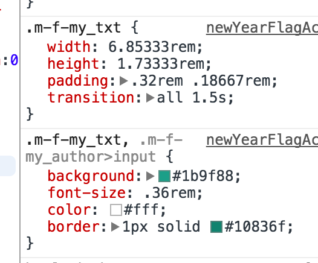

# Sass学习笔记


---

## **前言**

项目中的css预编译选择的是sass，准确的说应该是scss。由于之前没有用过，所以对其进行初步的学习。

---

## **简介**

sass是css预处理的一种方法，作用在于使编写css变得更加简化。

sass与scss的区别在于sass没有大括号，通过缩减来控制代码，而scss则和css类似，保留了大括号语法。

---

## **语法**

### **变量**

sass中可以设置变量
``` css
    $blue : #1875e7;　
    div {
       color : $blue;
    }
```
如果变量需要镶嵌在字符串之中，就必须需要写在#{}之中。
``` css
    $side : left;
    .rounded {
        border-#{$side}-radius: 5px;
    }
```

### **嵌套**
嵌套特性非常常用，在工程中十分方便：

``` css
nav {
  ul {
    margin: 0;
    padding: 0;
    list-style: none;
  }

  li { display: inline-block; }

  a {
    display: block;
    padding: 6px 12px;
    text-decoration: none;
  }
}
//-----------------------------------
//转化结果为：
nav ul {
  margin: 0;
  padding: 0;
  list-style: none;
}

nav li {
  display: inline-block;
}

nav a {
  display: block;
  padding: 6px 12px;
  text-decoration: none;
}
```
在嵌套的代码块内，可以使用$引用父元素。比如a:hover伪类，可以写成：
``` css
a {
　　　　&:hover { color: #ffb3ff; }
　　}
```

### **高级嵌套**

从 Sass3.3 开始，可以在同一行中使用最近选择器引用(&)来实现高级选择器，比如：
``` css
.foo {
  &-bar {
    color: red;
  }
}
```
生成的 CSS:
```
.foo-bar {
  color: red;
}
```
这种方式通常被用来配合 BEM 全名方式使用，基于原选择器（比如 .block）生成 .block__element and .block--modifier 选择器。


### **文件导入**

我们通过@import来导入别的sass文件：

``` css
@import 'reset';
```

### **mixin**

mixin用来处理兼容性代码最合适不过了：
``` css
@mixin box-sizing ($sizing) {
    -webkit-box-sizing:$sizing;     
       -moz-box-sizing:$sizing;
            box-sizing:$sizing;
}
.box-border{
    border:1px solid #ccc;
    @include box-sizing(border-box);
}
//转为：
.box-border {
  border: 1px solid #ccc;
  -webkit-box-sizing: border-box;
  -moz-box-sizing: border-box;
  box-sizing: border-box;
}
```

这里注意定义@mixin和引用@include。

上面的特性是比较常用的，还有一些数据的运算和颜色的函数等其实不怎么常用，这里就先不整理了。

### **extend**

先看看用法:
``` css
%inputstyle {
    background: #1b9f88;
    font-size: rem(27px);
    color: #fff;
    border: 1px solid #10836f;
}
.txt {
    @include size(rem(514px), rem(130px));
    @extend %inputstyle;
    padding: rem(24px) rem(14px);
    transition: all 1.5s;
}
input {
     @include size(rem(196px), rem(64px));
     margin-left: rem(14px);
     padding: 0 rem(16px);
     @extend %inputstyle;
     transition: all 1.5s;
 }  
```
效果如下: 
   


### **MAP**
sass3.3后引入了map类型,这里以**管理页面各个元素的z-index**为例.
```scss
$z-layers: (
    'toast':          4000,
    'modal':          3000,
    'dropdown':       2000,
    'mask':           1000,
    'default':         1,
    'below':          -1,
    'bottomless-pit': -10000
);
```

定义函数:
```scss
@function z($layer) {
    @if not map-has-key($z-layers, $layer) {
        @warn "No z-index found in $z-layers map for `#{$layer}`. Property omitted.";
    }

    @return map-get($z-layers, $layer);
}
```

使用方式如下:
```scss
//function方式
.m-mask {
    z-index: z('mask');
}

//mixin方式
.m-mask {
    @include z('mask');
}
```

---

## **感悟**

其实sass本身就是一门工具，如果css本身的功能足够强大了，它的作用也就越来越小了，所以说只在用到的时候看看就可以了。

