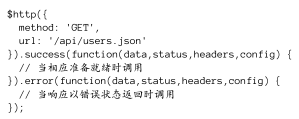
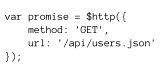
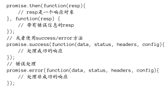
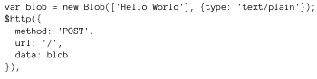
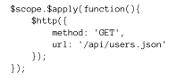
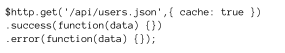
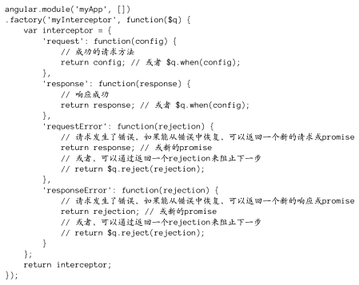
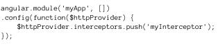
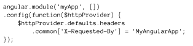
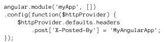

# AngularJS之XHR基础

---

## **前言**

在AngularJS中进行服务器间通信的方式有很多，可以使用内置服务$http或者$resource，也可以使用如Restangular等库。

这里我们只说说$http服务，其他复杂的内容等日后有使用需求再一一补上。

---

## **使用$http**

$http服务只是简单的封装了浏览器原生的XMLHttpRequest对象。

$http服务是只能接受一个参数的函数，这个参数是一个对象，包含了**用来生成HTTP请求的配置内容**。这个函数**返回一个promise对象，具有success和error两个方法**。

来看看最基本的使用场景：



我们给$http中传入的不是一个简单的回调函数，这个方法**实际上返回了一个promise对象**，当promise对象返回后，我们可以进行链式的调用。






### **传参**

在配置中加上
```
params:{'name':'liufang'}
```

这样的格式即可。

如果是传递数据，则使用data属性：





### **apply**

我们调用http方法后，在下一个$digest循环运行之前它并不会被真正执行。如果我们需要强制digest循环执行，可以将http放入apply：




---

## **快捷方法**

就和jquery的ajax方法一样，http也有自己的快捷方法比如get，post等。

具体的可以查阅[API](http://docs.angularjs.cn/api/ng/service/$http "")

这里只以jsonp举一个例子：

```
$http.jsonp("api/users.json?callback=JSON_CALLBACKA");
```

---

## **缓存HTTP请求**


默认是不缓存的，我们可以手动配置cache属性为true：



---

## **$httpProvider**


### **拦截器**

在请求发送给服务器之前或者从服务器返回时对其进行拦截。比如身份验证等场景，拦截器都是比较好的手段。


我们来看看一个例子：




先创建一个拦截器服务，再到$httpProvider中注册：




### **HTTP头**

我们看看如何设置HTTP头：



我们也可也只对POST或者别的类型的请求进行设置：




---

## **感悟**

只是说到了最基础的$http,和jquery中的ajax差不多，很基础。


