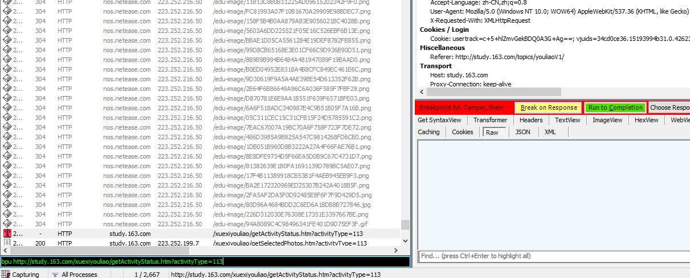

# **前言**

Fiddler是一个网络抓包工具，willow是一个Fiddler的插件，提供重定向和host主机等功能。
这里记录自己在使用该工具时的经验。

---
# **安装**
Fiddler的安装包地址：[fillder+willow](http://download.csdn.net/detail/mevicky/9280571)

解压后安装fiddler4和willow1.4.*版本。
安装成功后，启动fiddler后会出现willow插件按钮：

说明安装成功。

---

# **重定向**

这里需要说明的是，不仅仅可以将线上的url指向本地的文件，还可以**重定向接口**，将接口url重定向到本文一个装载了json格式的txt文件即可。

有时候我们的接口带有时间戳或随机性参数比如token等。我们可以通过正则来匹配：

---
# **willow重定向**
进入willow界面后，通过右键->Add Project ->Add Rule可以添加规则。

将Match中资源内容重定向到本地文件系统中去。

当我们再到线上去请求Match中资源时，黄色部分就是我们重定向的标志了：

也就是说，我们能够将相关文件脱离开发环境却不影响线上调试。

---
# **移动端抓包**
首先修改PC端Fiddler配置，进入Tools菜单的Fiddler Options中的Connections。

将Allow remote computers to connect 选中，重启fiddler后生效。

接下来是配置移动端的http代理。

ios系统直接连接到局域网内，将wifi中下方的http代理信息填写。服务器就是pc所在的ip地址，端口就是刚刚配置的8888。

然后在移动端中访问页面，就可以通过fiddler来抓包了。

如果是APP内嵌网页的话，可以配合安卓模拟器**Genymotion**来进行抓紧，需要在模拟器中的手机中访问ip:8888，然后下载fiddler的证书，这样就可以访问https了。

---
# **禁用缓存**

在进行调试的过程中，我们希望可以立即显示出效果，所以不希望有缓存，我们可以在fiddler里面设置禁用缓存：
Rules->Performance->Disable Caching

---
# **伪造数据请求**
可以使用composer构造请求报文进行快速测试，可以指定重新发送某条请求。

将左侧的请求拖到composer中，修改请求头后点击execute，就会产生一个新的请求提交，再查看。

注意，这里**composer只能伪造请求，不能伪造响应**噢。

如果参数有规律，我们还可以序列化多次伪造请求。
通过Composer工具，在parsed面板中，在需要伪造的参数处写成#,然后执行：
分别填入起始数据，和结束数据。

就可以看到结果了：

---

# **连续发送请求**

replay是重新发送改请求
replay按下的同时按下shift

---

# **设置断点修改返回结果**

如果我们需要长期修改返回结果，可以通过上面讲到的重定向的方式指向本地的某个文件，在文件中写入想要的结果。如果我们只需要这一次修改返回结果，或者说我们需要修改到HTTP头的话，则通过：
bpu url的名字，来设置断点，然后刷新页面，从而修改结果。
最后通过bpu取消断点。

