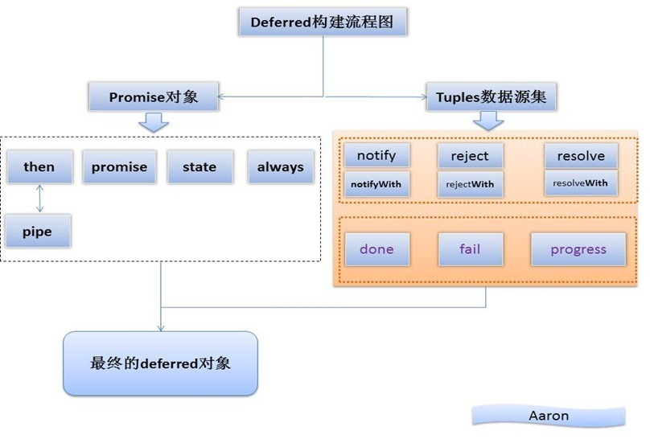

# **前言**

之前在[一篇文章](http://brizer.github.io/2016/03/16/jQuery%E5%BC%82%E6%AD%A5when%E7%94%A8%E6%B3%95/ "")中写过一点when方法的使用，最近看到[同事的一篇文章](http://www.fed123.com/2014/09/16/2014_jquery_defered/ "")，又详细学习了deferred方法的各种使用技巧。特此总结。

---

# **简单介绍**

deferred对象就是jQuery的回调函数解决方案，jQuery之前的版本在异步回调这一块做得不是很好，所以后期加上了该解决方案。



---
# **普遍的ajax操作**

我们先来回顾一下jQuery中普通的ajax操作：

``` javascript
$.ajax({
	url: "test.html",
	success: function(){
		alert("哈哈，成功了！");
	},
	error:function(){
		alert("出错啦！");
	}

});
```

1.5版本后的新写法如下：

``` javascript
$.ajax("test.html")
	.done(function(){ alert("哈哈，成功了！"); })

	.fail(function(){ alert("出错啦！"); });
```

新版本的写法相比老版本有一个优势，就是可以自由添加多个回调函数,他们按照添加顺序执行：

``` javascript
$.ajax("test.html")
	.done(function(){ alert("哈哈，成功了！");} )
	.fail(function(){ alert("出错啦！"); } )
	.done(function(){ alert("第二个回调函数！");} );
```

---

# **为多个ajax指定回调函数**

我们可以通过when方法，为多个事件指定一个回调函数，这就是我之前在项目中的使用需求：

``` javascript
$.when($.ajax("test1.html"), $.ajax("test2.html"))
.done(function(){ alert("哈哈，成功了！"); })
.fail(function(){ alert("出错啦！"); });
```

只有当两个ajax请求都成功之后，才会运用done方法。

---

# **为普通操作指定回调函数**

前面说到的when是用于ajax方法，而ajax方法其实是deferred对象，如果不是ajax方法，而是普通的函数呢？如果直接像上面一样使用when，是不会有效果的，会直接执行done方法。

所以我们需要手动新建一个deferred对象：


``` javascript
var dtd = $.Deferred(); // 新建一个deferred对象
var wait = function(dtd){

	var tasks = function(){

		alert("执行完毕！");

		dtd.resolve(); // 改变deferred对象的执行状态

	};

	setTimeout(tasks,5000);

	return dtd;

};
```

这里的resolve就是触发done的，对应的reject方法则是用来调用fail方法的。

``` javascript

var dtd = $.Deferred(); // 新建一个Deferred对象
var wait = function(dtd){

	var tasks = function(){

		alert("执行完毕！");

		dtd.reject(); // 改变Deferred对象的执行状态

	};

	setTimeout(tasks,5000);

	return dtd;

};

$.when(wait(dtd))

	.done(function(){ alert("哈哈，成功了！"); })

	.fail(function(){ alert("出错啦！"); });
```

---

# **进一步优化**

上面的代码有一些问题，就是dtd对象是暴露在全局的，所以我们可以通过在全局进行dtd.resolve()来提前回调。

为了避免这种情况，jQuery提供了deferred.promise()方法，它的作用是，在原来的deferred对象上返回另一个deferred对象，后者只开放与改变执行状态无关的方法（比如done方法和fail方法）屏蔽与改变执行状态有关的方法（比如resolve和reject方法）。

``` javascript
var dtd = $.Deferred(); // 新建一个Deferred对象
var wait = function(dtd){

	var tasks = function(){

		alert("执行完毕！");

		dtd.resolve(); // 改变Deferred对象的执行状态

	};

	setTimeout(tasks,5000);

	return dtd.promise(); // 返回promise对象

};

var d = wait(dtd); // 新建一个d对象，改为对这个对象进行操作

$.when(d)

	.done(function(){ alert("哈哈，成功了！"); })

	.fail(function(){ alert("出错啦！"); });

d.resolve(); // 此时，这个语句是无效的
```

当然，我们也可以把dtd包在函数内：

``` javascript
var wait = function(dtd){
	var dtd = $.Deferred(); //在函数内部，新建一个Deferred对象
	var tasks = function(){
		alert("执行完毕！");
		dtd.resolve(); // 改变Deferred对象的执行状态
	};
	setTimeout(tasks,5000);
	return dtd.promise(); // 返回promise对象
};

$.when(wait())
	.done(function(){ alert("哈哈，成功了！"); })
	.fail(function(){ alert("出错啦！"); });
```

