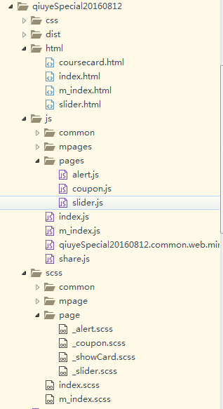
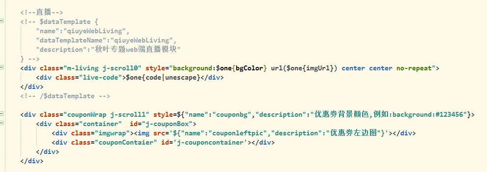
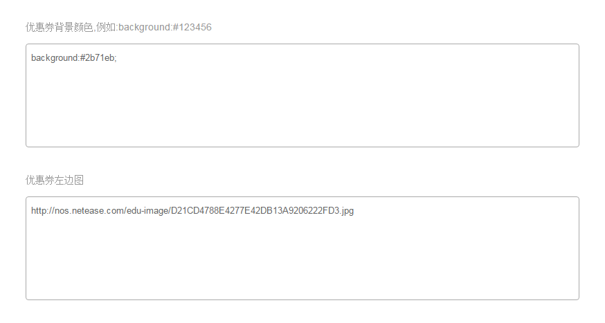

# **前言**

实习了这么久，也做过不少活动专题了。是时候理清思路整理一下活动专题的开发流程，并抛砖引玉说说针对单页专题的调试模式思路了。

---

# **活动专题页**

活动专题页其实就是大家经常在微信朋友圈或者各大网站平台轮播图中见到的一种，**带有简单业务逻辑的宣传性单页**。

这样的页面有几个特点：
1. 结构复杂，各个组件通过引入到一个单页index.html来呈现
2. css样式和js脚本通过内联方式引入到index.html
3. 通过数据模板，和cms系统配合，使得页面中的各个文案以及图片由运营配置，从而提高复用性

前面两个都比较好理解，无非就是为了提高加载速度。比如我们的一个活动专题结构如下：



我们通过脚本执行自动化命令，将scss转成css，然后和js一起打包合并到dist文件夹中的index.html中。

至于第三点，活动专题页面通过会做成模板的形式，这样就可以让运营在模板的基础上，通过修改文案、图片或简单的样式来自己生成不同的专题。
比如我们看看[云妞官报1期](http://study.163.com/topics/studyblog0/)和[云妞官报49期](http://study.163.com/topics/studyblog49/)，就会发现，其实两者都是使用的同一个模板，只是文案的图片不同。

我们通过在index.html中，使用各种数据模板来实现运营的自由配置功能。



这里主要说思路，具体的模板语法就不介绍了。

然后我们会有一个专门的cms系统给运营使用，效果如下：



从而实现自由配置。


---

# **开发流程**

在开发的过程中，多人各自负责自己的模块或者组件，然后主页负责拼接合并。各自将样式逻辑以及需要运营配置的数据模块完成后，进行发布脚本。发布到测试环境的cms系统上。cms系统本身会将上面说到的数据模板，和运营填写的内容进行**正则匹配填充**，从而呈现到用户的面前。


所以在开发到需要联调接口或者数据模板填充的阶段，我们需要将代码发布到测试环境，并有可能互相发布各自的代码，从而影响彼此的开发，毕竟我们不可能每次有改动发布就git操作一次嘛。

这个时候就可以用到调试模式。

---

# **调试模式**


这个问题还比较严重，两个人同时在调试，A 发了代码导致 线上出现了错误，那么就耽误了B的调试，只能自己发一遍覆盖A的，要不就是等待A把问题解决了之后再调试。

所以我们需要找到一个调试方法，**本地的修改能实时看到效果但是又不会影响到别人**。

其实我们可以使用本地文件代理方法。
把线上js、css替换成本地的对应的文件，我们只要改本地文件就能看到效果。但是我们的js、css是打包在html文件中的。那么我们设定一个调试模式，**调试模式开启的时候抛两个空的请求出来，让我们调换成本地文件，并且不执行原来的代码。否则执行原来的代码**。
  
这种互不影响的调试方式，还是比较方便的，只需要在打包或者发布模板的时候加上参数就可以了。
自动发布专题文件夹下的模板到**测试**环境的cms,不压缩，且可以开启调试模式的js代码common.web.in.js：

```
$ node ./lib/publish_template.js --name=specialname --uglify=false  --debugMode=true
```

然后在访问的时候在链接后面加?debug=true就好了。
http://study.163.com/topics/freeGetCourseActivity/?debug=true


那么debugMode参数的原理是什么呢？和不加参数的区别在于哪里呢？

---

# **原理**

前面说到的**publish_template脚本的作用**其实就是将css,js文件合并内联到index.html中，然后将其写入cms系统的mongo数据库中。
如果加上了debugMode参数，会调用以下方法：

``` javascript
// 添加调试脚本
util.addDebugScript = function(_text, _type){

    if(!_text || !_type){

        console.log('no text or no script type');
        return;
    }

    if(_type == 'css'){

        return ('<script id="addCssScript">\
            function insertStyle(){\
                var style = document.createElement("style"),\
                    cssText = document.createTextNode(\'' + _text + '\');\
                style.appendChild(cssText);\
                style.setAttribute("type", "text/css");\
                document.body.appendChild(style);\
            }\
            function insertLink(){\
                    var doc = document,\
                        link = doc.createElement("link");\
                    link.setAttribute("type", "text/css");\
                    link.setAttribute("rel", "stylesheet");\
                    link.setAttribute("href", "http://cst.stu.126.net/u/css/cms/forTestStyle.css");\
                    doc.getElementsByTagName("head")[0].appendChild(link);\
            }\
            if(window.location.search.indexOf("debug=true") == -1){\
                insertStyle();\
            }else{\
                insertLink();\
            }\
            document.getElementById("addCssScript").remove();\
        </script>');
    }

    if(_type == 'js'){

        var scriptCode = 'function insertJs(){\
               ' + _text + '\
            }\
            function insertScript(){\
                var script = document.createElement("script");\
                script.setAttribute("src", "http://cst.stu.126.net/u/js/cms/forTestScript.js");\
                document.body.appendChild(script);\
            }\
            if(window.location.search.indexOf("debug=true") == -1){\
                console.log("execute here");\
                insertJs();\
            }else{\
                insertScript();\
            }';

        return scriptCode;
    }
}
```

其作用就是不是将css,js文件内联入index.html,而是单独引入空的css,js文件。
然后我们[使用fillder进行文件重定向](http://brizer.github.io/2016/05/11/fiddler%E4%BD%BF%E7%94%A8%E5%AE%9E%E8%B7%B5/)，将这多出的两个文件重定向到本地的开发文件，从而进行开发，这样就避免了多个开发者互相影响。


---

# **思考**

其实如果没有数据模板和cms系统结合这一步，或者说一个不需要用到数据模板的专题页面，我们可以通过直接将index.html重定向来进行调试。

针对于线上环境的调试，大致也是这种思路，通过重定向到本地，修改本地文件，利用线上数据推演本地逻辑，从而完成正确的程序后再发布。


