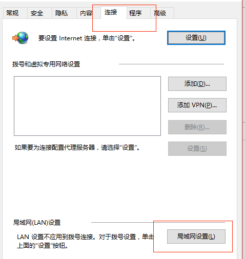

# **前言**

遇到过很多次，浏览器不能上网但其他应用程序可以，解决方案在网上老是搜索不到，特此整理，造福人类。

---

# **解决方案**

以前都是利用360来解决的，后面在公司电脑未安装360的情况下也出现了这个问题，IT部帮忙解决了。   
答案就是：
1、打开ie浏览器
2、点击右上角工具，选中**Internet选项**
3、打开连接中的**局域网设置**

4、确保**代理服务器**未被勾上

即可。是不是很嗨。