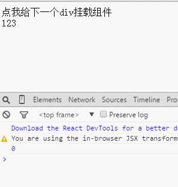
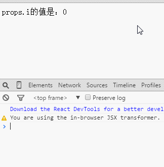
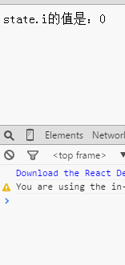
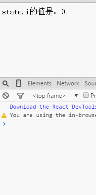
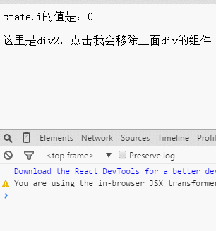
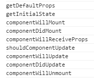

# React之组件的生命周期


---

## **前言**

前面学习了组件的基本API，本文主要学习React中组件的生命周期。并对每一个阶段的触发事件进行详细学习。

---

## **生命周期**

组件的生命周期包含三个主要部分：

**挂载**： 组件被插入到DOM中。
**更新**： 组件被重新渲染，查明DOM是否应该刷新。
**移除**： 组件从DOM中移除。

React提供生命周期方法，你可以在这些方法中放入自己的代码。我们提供will方法，会在某些行为发生之前调用，和did方法，会在某些行为发生之后调用。

### **挂载阶段**

`getInitialState()`: object在组件被挂载之前调用。状态化的组件应该实现这个方法，返回**初始的state数据**。

`componentWillMount()`: 在**挂载发生之前**立即被调用。

`componentDidMount()`: 在**挂载结束之后**马上被调用。需要DOM节点的初始化操作应该放在这里。

### **更新阶段**

`componentWillReceiveProps(object nextProps)`: 当一个挂载的组件**接收到新的props的时候**被调用。该方法应该用于比较`this.props`和`nextProps`，然后使用`this.setState()`来改变state。

`shouldComponentUpdate(object nextProps, object nextState): ` 当组件做出是否要**更新DOM的决定的时候**被调用。实现该函数，优化`this.props`和`nextProps`，以及`this.state`和`nextState`的比较，如果**不需要React更新DOM，则返回false**。

`componentWillUpdate(object nextProps, object nextState)`: 在**更新发生之前**被调用。你可以在这里调用`this.setState()`。

`componentDidUpdate(object prevProps, object prevState)`: 在更新发生之后调用。

### **移除阶段**

`componentWillUnmount()`： 在**组件移除和销毁之前**被调用。清理工作应该放在这里。

---
## **方法**

接下来我们一一学习呢。

### **getDefaultProps**

该方法是所有我们提及的方法中最先触发的，你可以在该方法里 return 一个对象来作为组件默认的Props值（当然如果父组件传进来了props，则以传进来的为主），它只在组件**初次挂载到页面上时触发一次**，即使你重新挂载了组件。

### **getInitialState**

用于给组件初始化state的值，调用该方法要求必须 return 一个对象或者null，否则会报错。该方法在组件每次实例化（也就是**挂载**）**的时候都会触发**。

### **componentWillMount**

在组件`挂载之前`执行操作，但**仅执行一次**，即使多次重复渲染该组件，或者改变了组件的state：

``` javascript
    var i = 0;
    var Component1 = React.createClass({
        componentWillMount: function(){
            console.log(i++)
        },
        getInitialState: function() {
            return {
                isClick: !1
            }
        },
        clickCb: function() {
            this.setState({
                isClick : !0
            })
        },
        render: function() {
            return <div onClick={this.clickCb}>isClick:{this.state.isClick? 'yes' : 'nope'}</div>
        }
    });
    var div = document.getElementById('a');
    React.render(
        <Component1 />,div
    );
    React.render(
        <Component1 />,div
    );
```

i会一直保持0。除非我们使用 `React.unmountComponentAtNode`移除组件，再渲染。
``` javascript
    var div = document.getElementById('a');
    React.render(
        <Component1 />,div
    );
    React.unmountComponentAtNode(div);  //移除掉已有组件
    React.render(
        <Component1 />,div
    );
```

就可以再次调用`componentWillMount`中的方法。

### **componentDidMount**

顾名思义可以猜到这个是在组件`初始化挂载之后执行`的。

同 `componentWillMount` 一样，同一个组件重复渲染`只执行一次`，卸载组件后重新渲染可以重新触发一次：

``` javascript
    var i = 0,
        div = document.getElementById('a'),
        div2 = document.getElementById('b');

    var Component1 = React.createClass({
        componentDidMount: function(){
            console.log(i++)
        },
        clickCb: function() {
            React.render(
                <Component1 />, div2
            );
        },
        render: function() {
            return <div onClick={this.clickCb}>点我给下一个div挂载组件</div>
        }
    });

    React.render(
        <Component1 />, div
    );
    //React.unmountComponentAtNode(div);  //移除掉已有组件
    React.render(
        <Component1 />, div
    );
```

点击div1时会将组件挂载到div2上，触发div2的组件的 `componentDidMount` 回调（毕竟div1和div2上的组件并非同一个）

### **componentWillReceiveProps**

在组件**接收到新props的时间点之前调用**，注意组件初始化渲染时则不会执行：

``` javascript
    var i = 0,
        div = document.getElementById('a'),
        div2 = document.getElementById('b');

    var Component1 = React.createClass({
        componentWillReceiveProps: function(){
            console.log(i++)
        },
        clickCb: function() {
            React.render(
                <Component1 />, div2
            );
        },
        render: function() {
            return <div onClick={this.clickCb}>点我给下一个div挂载组件</div>
        }
    });

    React.render(
        <Component1 />, div  //初始化不会触发componentWillReceiveProps
    );
    React.render(
            <Component1 />, div   //重复渲染会触发componentWillReceiveProps
    );
    React.unmountComponentAtNode(div);  //移除掉已有组件
    React.render(
        <Component1 />, div  //初始化不会触发componentWillReceiveProps
    );
```

我们移除掉组件再挂载的时候，相当于重新初始化渲染了组件（得到的props是初始化props而不是新props），故不会触发 `componentWillReceiveProps` 。

而当我们在div2挂载了组件后再点击div2来重新渲染它的组件，会触发 `componentWillReceiveProps` ：



该方法有一个参数 `nextProps`，我们可以利用它来获取新 props 的值（this.props 获取到的是当前的，也就是旧的 props）：

``` javascript
    var i = 0,
        div = document.getElementById('a'),
        render = function(){
            React.render(
                    <Component1 i={i++} />, div
            );
        };

    var Component1 = React.createClass({
        componentWillReceiveProps: function(nextProps){
            console.log(this.props.i, nextProps.i)
        },
        render: function() {
            return <div onClick={render}>props.i的值是：{this.props.i}</div>
        }
    });
    render();
```



### **shouldComponentUpdate**

该方法在组件接收到了新的 props 或者新的 state 的时候（该时间点render还没执行哦）会立即调用，然后通过返回值（Boolean）来决定**是否要重新渲**染当前的组件。

该方法带有两个参数，第一个参数表示新的props，第二个参数表示新的state。

模拟现在要求div要点击3次之后，才重新渲染自身组件：

``` javascript
    var div = document.getElementById('a');

    var Component1 = React.createClass({
        getInitialState: function(){
            return { i : 0 }
        },
        shouldComponentUpdate: function(nextProps, nextState){
            console.log( this.state.i, nextState.i );
            return nextState.i > 3 ? true : false; //返回true才会渲染组件
        },
        clickCb: function(){
            this.setState({
                i : this.state.i + 1
            })
        },
        render: function() {
            return <div onClick={this.clickCb}>state.i的值是：{this.state.i}</div>
        }
    });
    React.render(
            <Component1 />, div
    );
```

效果如下：




### **componentWillUpdate**

同 `shouldComponentUpdate` 一样，在组件收到新的 `props` 或者 `state` 的时候会立即调用，而且也有着俩个参数来获取新的 props 和 state。

不过本方法会在 `shouldComponentUpdate` 执行**并返回了 true 的时候才会被调用**。我们拿上一个代码示例做点小修改：

``` javascript
   var div = document.getElementById('a');

    var Component1 = React.createClass({
        getInitialState: function(){
            return { i : 0 }
        },
        shouldComponentUpdate: function(nextProps, nextState){
            console.log( this.state.i, nextState.i );
            return nextState.i > 3 ? true : false; //返回true才会执行componentWillUpdate并重新渲染组件
        },
        componentWillUpdate: function(nextProps, nextState){
            console.log( 'yoyoyo', this.state.i, nextState.i );
        },
        clickCb: function(){
            this.setState({
                i : this.state.i + 1
            })
        },
        render: function() {
            return <div onClick={this.clickCb}>state.i的值是：{this.state.i}</div>
        }
    });
    React.render(
            <Component1 />, div
    );
```

效果如下：


### **componentDidUpdate**
该方法会在**组件更新、重新渲染完毕了之后才触发**，它和 `componentWillUpdate` 一样有着俩个参数来获取新的 props 和 state。

``` javascript
    var div = document.getElementById('a');

    var Component1 = React.createClass({
        getInitialState: function(){
            return { i : 0 }
        },
        shouldComponentUpdate: function(nextProps, nextState){
            console.log( this.state.i, nextState.i );
            return nextState.i > 3 ? true : false; //返回true才会执行componentWillUpdate并重新渲染组件
        },
        componentDidUpdate: function(nextProps, nextState){
            console.log( '已经渲染完毕咯', this.state.i, nextState.i );
        },
        componentWillUpdate: function(nextProps, nextState){
            console.log( '还没渲染哦', this.state.i, nextState.i );
        },
        clickCb: function(){
            this.setState({
                i : this.state.i + 1
            })
        },
        render: function() {
            return <div onClick={this.clickCb}>state.i的值是：{this.state.i}</div>
        }
    });
    React.render(
            <Component1 />, div
    );
```

效果如下：




### **componentWillUnmount**

在**组件要被移除之前的时间点触发**，可以利用该方法来执行一些必要的清理，比如清除无效的定时器，或者清除在 `componentDidMount` 中创建的 DOM 元素等：

``` javascript
    var div = document.getElementById('a'),
        div2 = document.getElementById('b');

    var Component1 = React.createClass({
        DOMArr : [],
        getInitialState: function(){
            return { i : 0 }
        },
        componentDidUpdate: function(nextProps, nextState){
            var dom = document.createElement('p');
            dom.innerText = this.state.i;
            div2.appendChild(dom);
            this.DOMArr.push(dom);
        },
        componentWillUnmount: function(){
            if(!this.DOMArr.length) return;
            var i = 0;
            while(i < this.DOMArr.length){console.log(i);
                div2.removeChild(this.DOMArr[i++]); //移除componentDidUpdate里添加过的DOM
            }
        },
        clickCb: function(){
            this.setState({
                i : this.state.i + 1
            })
        },
        render: function() {
            return <div onClick={this.clickCb}>state.i的值是：{this.state.i}</div>
        }
    });
    React.render(
            <Component1 />, div
    );

    div2.addEventListener('click',function(){
        React.unmountComponentAtNode(div) //点击div2则卸载掉第一个div里的组件
    }, false)
```

效果如下：



---

最后理一下全部的触发顺序：



---

## **参考**

[浏览器中工作原理][1]
[组件详细说明和生命周期][2]
[React入门系列][3]


  [1]: http://reactjs.cn/react/docs/working-with-the-browser.html
  [2]: http://reactjs.cn/react/docs/component-specs.html
  [3]: http://www.cnblogs.com/vajoy/p/4603355.html