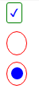

# **前言**

有时候，我们自己定义一些公司项目内部用的组件时，会对浏览器的各种组件进行样式修改。这里主要说一下checkbox和radio组件的样式修改方式。

---

# **实现**

首先看看效果：


其实现原理就是将input隐藏，然后通过label指向input，对input和其伪元素进行样式修改。

我们先看看chechbox：

html：
``` html
<input type="checkbox" id="check1" class="checkbox1" />
<label for="check1"></label>
```
css:
``` css
.checkbox1 {
  display:none;
}
.checkbox1 + label {
  position:relative;
  padding:4px 9px;
  border:1px solid green;
  border-radius:3px;
}
.checkbox1:checked + label:after {
  position:absolute;
  content:'\2714';
  font-size:14px;
  top:2px;
  left:3px;
  color:blue;
}
```

再来看看radio：

html：

``` html
  <input type="radio" id="radio1" name="radio1-1" class="radio1" />
  <label for="radio1"></label>
  <div class="" style="height:20px;"></div>
  <input type="radio" id="radio2" name="radio1-1" class="radio1" />
  <label for="radio2">
```

对应css：

``` css
.radio1 {
  display:none;
}
.radio1 + label {
  position:relative;
  padding:6px 12px;
  border:1px solid red;
  border-radius:50%;
}
.radio1:checked + label:after{
  position:absolute;
  top:6px;
  left:5px;
  content:'';
  width:15px;
  height:15px;
  font-size:32px;
  border-radius:50%;
  background-color:blue;
}
```

---

# **完整示例**

完整示例如下：

<p data-height="266" data-theme-id="0" data-slug-hash="xVyKax" data-default-tab="css,result" data-user="brizer" data-embed-version="2" class="codepen">See the Pen <a href="http://codepen.io/brizer/pen/xVyKax/">自定义浏览器元素组件样式</a> by 刘放 (<a href="http://codepen.io/brizer">@brizer</a>) on <a href="http://codepen.io">CodePen</a>.</p>
<script async src="//assets.codepen.io/assets/embed/ei.js"></script>